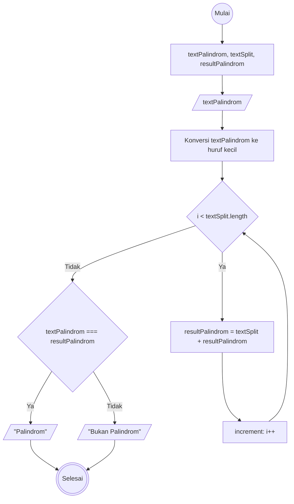
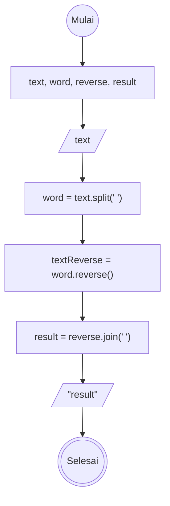

## 1. Deteksi Palindrom
1. Mulai
2. Buat penampung untuk split kata sebagai 'textSplit' dan penampung hasil palindrom sebagai "resultPalindrom"
3. Masukkan kata sebagai 'textPalindrom'
4. Ubah textPalindrom ke huruf kecil semua.
5. Pisahkan setiap hurufnya dan Balikkan urutan karakternya dari 'textPalindrom', yang hasilnya masuk ke dalam penampung 'textSplit'
6. Gabungankan kata pada textSplit ke dalam resultPalindrom
7. Bandingkan isi data textPalindrom dan resultPalindrom, Jika sama maka hasil outputnya "Palindrom"
8. Jika tidak maka outputnya "Bukan Palindrom" 
9. Selesai

**Flowchart**

## 2. Reverse Words

1. Mulai
2. Buat Penampung untuk pemisah kata sebagai 'word', pembalikan kata sebagai 'reverse' dan hasilnya ke 'result'
3. Masukkan kalimat sebagai 'text'
4. Pisahkan 'text' menjadi daftar kata lalu masukan ke dalam 'word'
5. balikkan urutan pada 'word', simpan ke 'textReverse'
6. gabungkan kata pada 'textReverse' yang telah di balik menjadi satu kalimat ke dalam 'result'
7. Tampilkan hasilnya
8. Selesai

**Flowchart**

